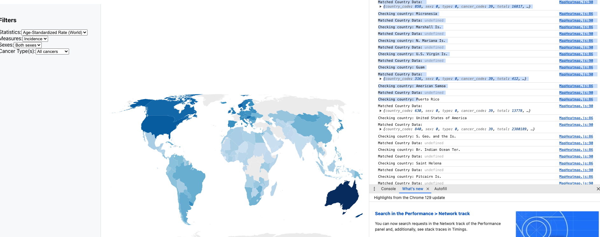

This project is a bioinformatics visualization app that leverages D3.js to create interactive visualizations for data retrieved from the TCGA (The Cancer Genome Atlas) API, specifically focusing on the TCGA-BRCA dataset (Breast Invasive Carcinoma). It includes various types of data visualizations such as time series, bubble charts, heatmaps, and network graphs to explore clinical and mutation data.

Features
Interactive Time Series Visualization: Visualize mutation data over time, interactively adjusting the data displayed.
Bubble Charts: Display gene expression and mutation data as bubbles, with hover functionality for additional details.
Network Graphs: Visualization of connections between genes or mutations using force-directed graphs.
Heatmaps: Analyze survival data or relationships between clinical factors such as age and survival.
Tree Diagrams: Explore hierarchical relationships between genes or mutations.
Will add more interactive visualizations later

Visualizations
Time Series Map: Mutation data displayed across a timeline.
Bubble Chart: Visualizes mutation and gene expression data.
Heatmap: Displays age-at-diagnosis versus survival rates.
Geo Heatmap: Displays different cancer rates over the world, with filters can select different features.
Network Graph: Illustrates relationships between genes and mutations.
Tree Diagram: Explores hierarchical data relationships.
Mutation Lolliplot: Represents mutations along a gene or protein sequence, with sizes indicating frequency or impact.
Variant Frequency Visualization: Shows mutation frequencies across populations or conditions in an interactive bar chart format.
3D DNA Visualization: Displays the DNA structure in a 3D interactive model, allowing users to explore the double helix and its components.

Data Source
TCGA: The Cancer Genome Atlas (https://portal.gdc.cancer.gov/)
Dataset: TCGA-BRCA (Breast Invasive Carcinoma)
Fetches data from the TCGA API, specifically from the TCGA-BRCA dataset.

Technologies Used
React.js: Frontend library for building user interfaces.
D3.js: Data visualization library.
TCGA API: For retrieving mutation, gene expression, and clinical data.
Git: For version control.

Future Enhancements
Add more interactivity and details to the hover features on charts.
Implement drag-and-drop functionality in the visualizations.
Expand the visualizations to support more data types and clinical insights.

## Project Screenshots

Here are some screenshots from the project:

### Screenshot 1

### Screenshot 2

### Screenshot 3

### Screenshot 5

### Screenshot 6

### Screenshot 7
